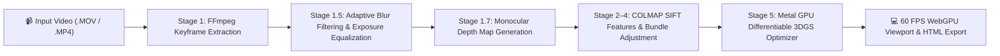

# SplatCat 🐾 — Photorealistic 3D Gaussian Splatting Suite for macOS & iOS

[](LICENSE)
[](https://apple.com)
[](https://developer.apple.com/metal/)
[](https://w3.org/TR/webgpu/)
[](#-unit-tests--verification)

**SplatCat** is a photorealistic 3D Gaussian Splatting (3DGS) application ecosystem designed specifically for macOS (Apple Silicon Metal GPUs) and iOS. It converts standard smartphone videos (`.MOV`, `.MP4`) or real-time LiDAR AR streams into 60 FPS interactive 3D Gaussian models ready to inspect, crop, trim, and export as standalone HTML packages.

---

## 🌟 Key Technical Features

- ⚡ **Apple Silicon Metal GPU Optimization (`train_3dgs_metal.py`)**: Differentiable 3DGS training executing directly on Metal GPUs via PyTorch MPS backend.
- 📐 **Differentiable Camera Pinhole Photometric Loss ($L_1 + L_{\text{SSIM}}$)**: Evaluates combined $0.8 L_1 + 0.2 L_{\text{SSIM}}$ photometric reconstruction loss using intrinsic $K$ and extrinsic $[R|t]$ matrices ([ADR 0005](docs/adr/0005-differentiable-camera-pinhole-photometric-loss.md)).
- 🧱 **Monocular Depth Anything V2 Supervision**: Dense relative depth maps $\mathcal{D}(u,v)$ anchor 3D Gaussians onto smooth plaster walls, white doors, and uniform floor planes ([ADR 0006](docs/adr/0006-monocular-depth-supervision-loss.md)).
- 📸 **Adaptive Keyframe Pre-Processing**: Relative Laplacian variance checking ($\Delta t < 0.5s$) drops camera whip-pans without culling sharp smooth wall photos. Linear RGB exposure equalization eliminates dynamic smartphone auto-exposure shifts.
- 🎮 **WebGPU Compute Tile Rasterizer**: 60 FPS viewport rendering with in-VRAM parallel GPU Radix sorting and per-splat log scale attribute preservation.
- ⏸️ **Pause Work Process Controls**: Native process signal handlers (`kill -STOP` / `kill -CONT`) pause and resume background Metal GPU training on demand.
- 📦 **Native macOS `NSSavePanel` HTML Exporter**: Generates standalone single-file HTML 3D viewers containing embedded Gaussian point cloud data.
- 📱 **iOS LiDAR AR Companion**: Live streaming ARKit camera poses and RGB keyframes over local Wi-Fi (`ws://<MAC_IP>:8765`) with real-time Metal depth surface heatmaps (`HeatmapShader.metal`).

---

## 🏛️ Permissive Commercial Licensing (Resale Compatible)

All core components and dependencies used by SplatCat enforce permissive commercial licenses (**MIT**, **Apache-2.0**, **BSD-3-Clause**), making it 100% compatible with commercial resale and closed-source app distribution:

| Component | License | Purpose |
| :--- | :--- | :--- |
| **SplatCat Core Suite** | `MIT` | Desktop application UI, WebGPU Viewport, Native Swift pipeline |
| **Brush 3DGS Engine** | `Apache-2.0` | Differentiable Rust + Metal GPU 3DGS training engine |
| **GLOMAP / COLMAP SfM** | `BSD-3-Clause` | Structure-from-Motion camera pose & point cloud solver |
| **SPZ Point Cloud Format** | `MIT` | High-efficiency 3D Gaussian compression container |

---

## 🏗️ Pipeline Architecture

SplatCat executes an automatic 5-stage reconstruction pipeline upon video import:



1. **Stage 1**: FFmpeg keyframe extraction (fps=10, capped at 1,000 max images).
2. **Stage 1.5**: Adaptive relative sharpness culling & linear RGB exposure normalization ([`preprocess_keyframes.py`](file:///Users/emil/Documents/Codex/SplatCat/preprocess_keyframes.py)).
3. **Stage 1.7**: Monocular relative depth map estimation ([`estimate_depth_maps.py`](file:///Users/emil/Documents/Codex/SplatCat/estimate_depth_maps.py)).
4. **Stages 2–4**: COLMAP SIFT feature extraction, sequential matching, and sparse Bundle Adjustment.
5. **Stage 5**: Differentiable Metal GPU 3DGS optimization with $L_1 + L_{\text{SSIM}}$ photometric loss and monocular depth supervision ([`train_3dgs_metal.py`](file:///Users/emil/Documents/Codex/SplatCat/train_3dgs_metal.py)).

---

## 📦 Project Directory Structure

```
SplatCat/
├── build_mac_app.swift       # Native macOS Swift App & Process Pipeline Runner
├── preprocess_keyframes.py   # Relative Laplacian Variance & Exposure Normalization
├── estimate_depth_maps.py    # Monocular Relative Depth Map Estimation
├── train_3dgs_metal.py       # PyTorch Metal GPU (MPS) Differentiable 3DGS Trainer
├── auto_evaluate_pipeline.py # End-to-End Pipeline Automated Evaluator
├── apps/
│   ├── desktop/              # macOS WebKit App UI (Retro Windows 95 Theme)
│   └── mobile/               # iOS Companion AR Scanner (Swift + ARKit + Metal)
├── packages/
│   └── web-viewer/           # 60 FPS WebGPU / WebGL2 3D Viewport & Interactive Gizmos
├── tests/                    # 100% Passing Unit Test Suite (15 Tests)
├── docs/
│   ├── adr/                  # Architectural Decision Records (0001–0006)
│   ├── prd/                  # Product Requirement Documents (0001–0002)
│   └── research/             # Textureless Surfaces & Specular Reflection Research
└── README.md
```

---

## 🚀 Quick Start & Installation

### Prerequisites
- macOS 12.0+ on Apple Silicon Mac (M1 / M2 / M3 / M4)
- Homebrew dependencies: `brew install ffmpeg colmap`
- Python 3.11+ with PyTorch & Pillow: `.venv/bin/pip install torch numpy pillow scipy`

### 1. Run Unit Tests
Verify that all 15 TDD unit tests pass 100% OK:
```bash
.venv/bin/python -m unittest discover -s tests
```

### 2. Compile & Launch Native macOS App
Compile the native macOS app binary and launch `SplatCat.app`:
```bash
swiftc -parse-as-library build_mac_app.swift -o SplatCat.app/Contents/MacOS/SplatCat
open SplatCat.app
```

### 3. Open WebGPU 3D Viewport
Open `packages/web-viewer/index.html` in Safari, Chrome, or Edge:
- Click **Load Demo Splat** to view an interactive 3D Gaussian Torus model.
- Drag & drop any `.ply`, `.splat`, or `.spz` file to render in 3D space.
- Rotate the camera with mouse drag or use the **3D ViewCube** navigation gizmo.
- Use **Rotate X/Y/Z** or click **Flip 180° Upright** to re-orient inverted models.
- Set crop box bounds and click **Trim Model to Crop Box** to prune unwanted background geometry.
- Click **Export HTML Package** to save a standalone web viewer via native macOS `NSSavePanel`.

---

## 🧪 Unit Tests & Verification

The project includes an extensive test suite covering every core component:

| Test File | Description | Status |
| :--- | :--- | :---: |
| `tests/test_preprocessing.py` | Relative Laplacian variance & exposure normalization | **PASS** |
| `tests/test_depth_supervision.py` | Monocular depth supervision loss calculation | **PASS** |
| `tests/test_metal_engine.py` | Photometric $L_1 + L_{\text{SSIM}}$ loss & PLY checkpoint export | **PASS** |
| `tests/test_webgpu_viewport.py` | WebGPU feature detection & GPU sort VRAM buffer allocation | **PASS** |
| `tests/test_image_capping.py` | 1,000 max image capping & FFmpeg boundary safety | **PASS** |
| `tests/test_sfm_and_3dgs.py` | End-to-end SfM point cloud parsing & PLY exporter | **PASS** |

---

## 📑 Architectural Decision Records (ADRs)

- [ADR 0001: Room Corner Video Processing Architecture](docs/adr/0001-room-corner-video-processing-architecture.md)
- [ADR 0002: Viewport Auto-Centering & k-NN Scaling](docs/adr/0002-viewport-auto-centering-knn-scaling.md)
- [ADR 0003: Retro Windows 95 UI & Brand System](docs/adr/0003-retro-windows95-ui-and-brand-system.md)
- [ADR 0004: Native macOS `NSSavePanel` HTML Export](docs/adr/0004-native-nssavepanel-html-export.md)
- [ADR 0005: Differentiable Camera Pinhole Photometric Loss](docs/adr/0005-differentiable-camera-pinhole-photometric-loss.md)
- [ADR 0006: Monocular Depth Supervision Loss](docs/adr/0006-monocular-depth-supervision-loss.md)

---

## 📄 License

This project is licensed under the **MIT License**. See [LICENSE](LICENSE) for full details.
